# Summary

# Maps w GIC and magetometer sites
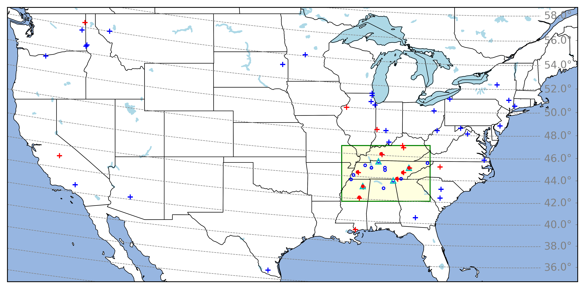

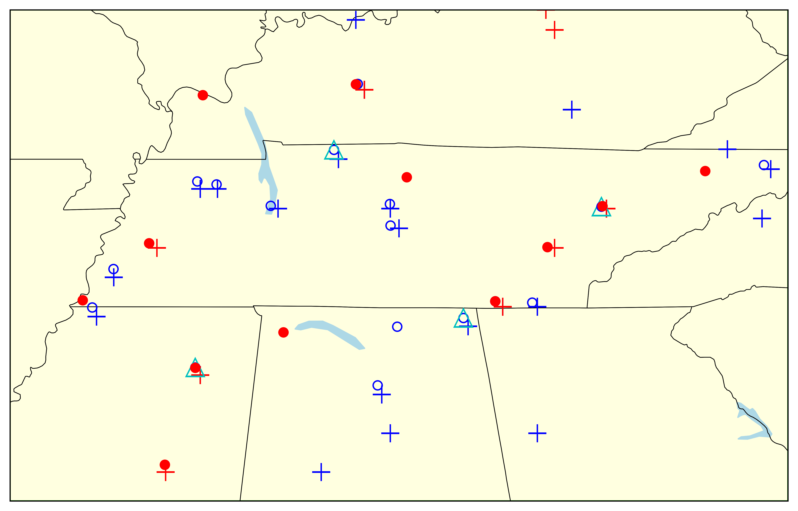

# Transmission line analysis

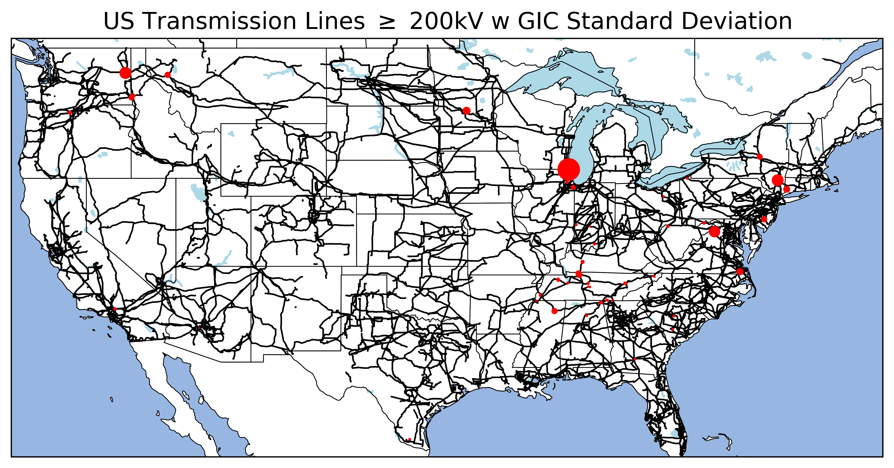

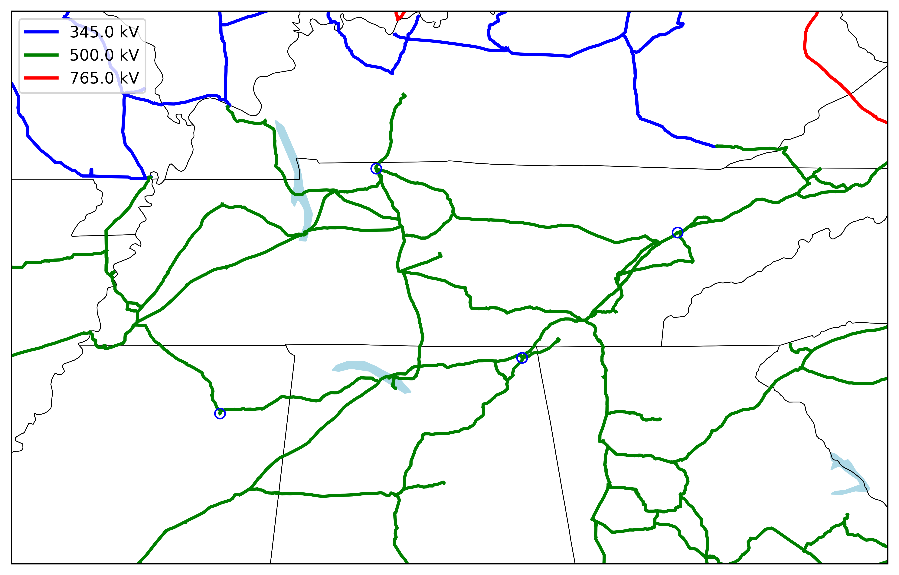

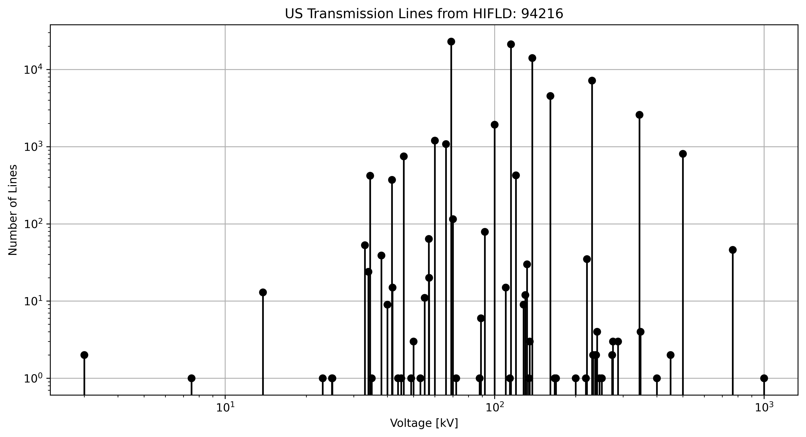

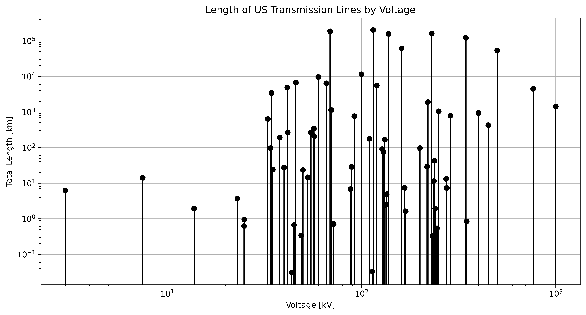

# TVA GIC vs TVA GIC modeled

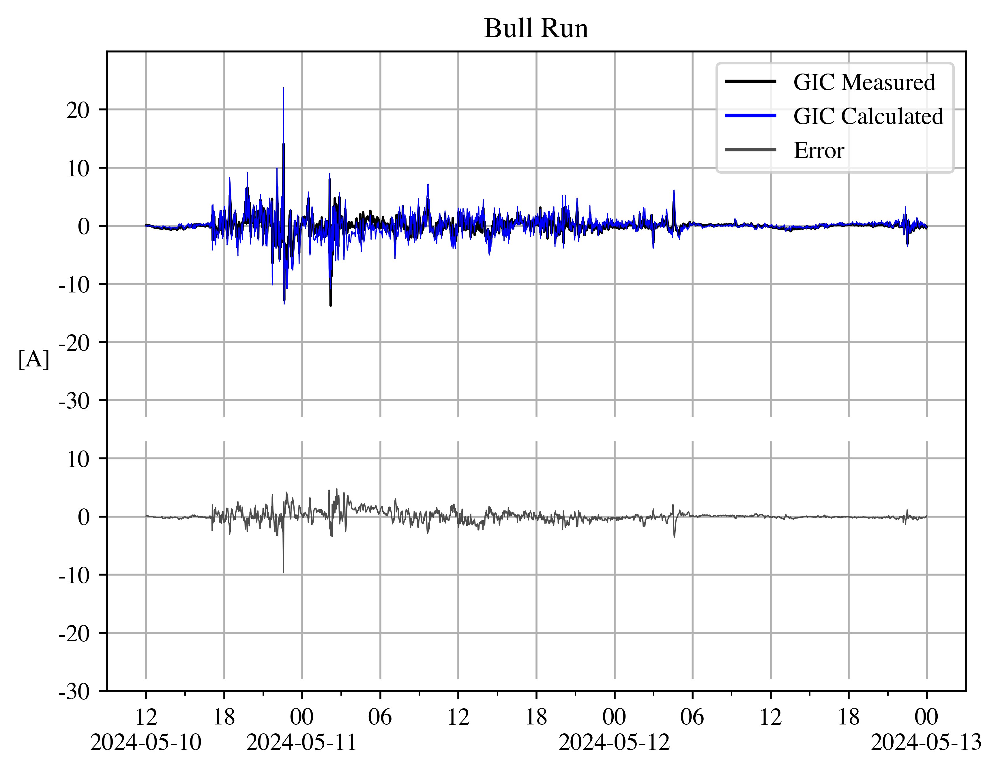

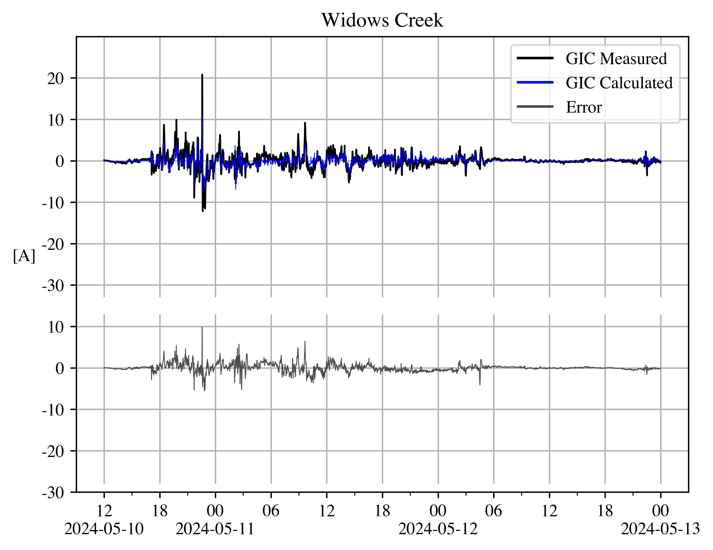

# TVA B vs MAGE/SWMF modeled

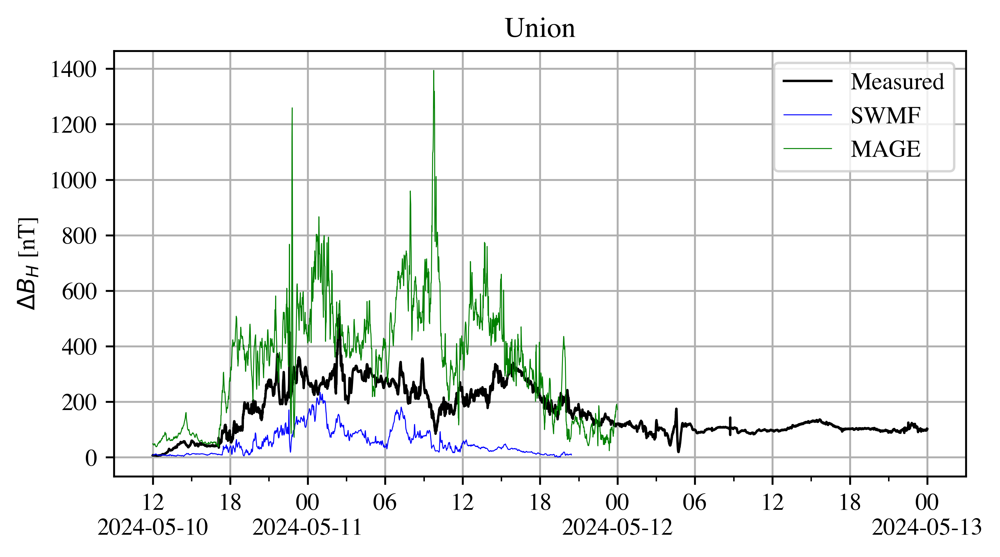

# GIC Time Series Comparisons

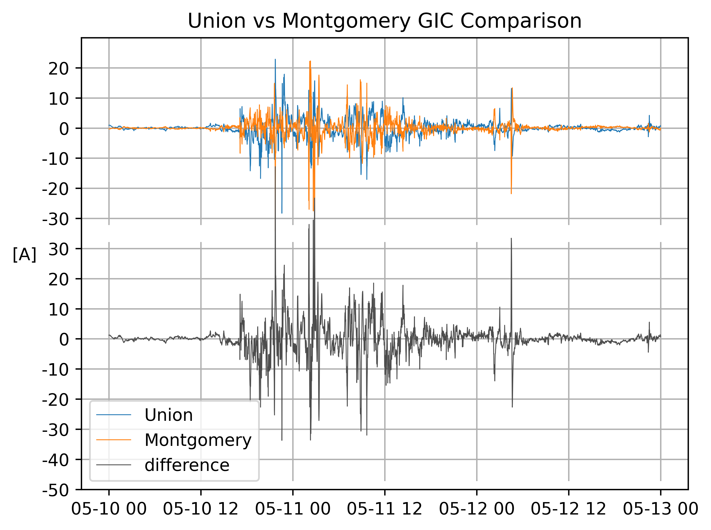

# GIC Time Series CC Comparisons

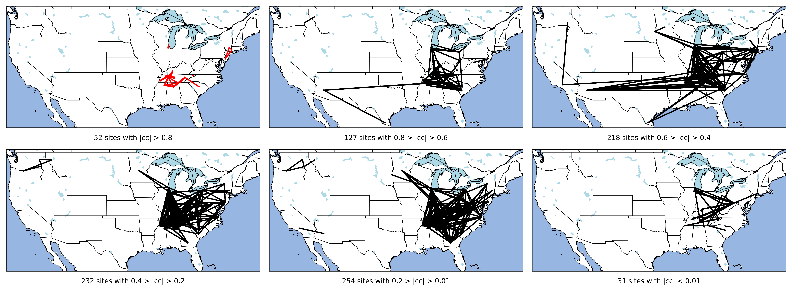

Results from one site

# GIC Time Series dist Comparisons

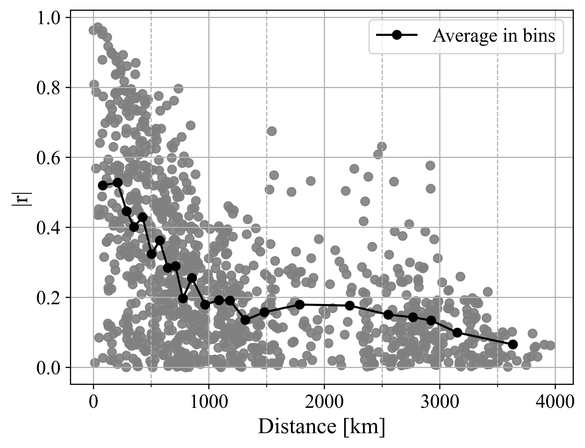

Results from one site

# GIC Time Series std Comparisons

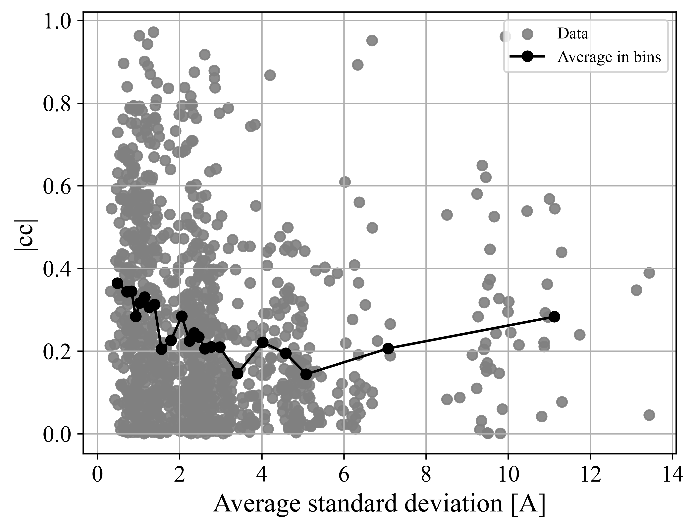

Results from one site

# GIC Time Series Beta Comparisons

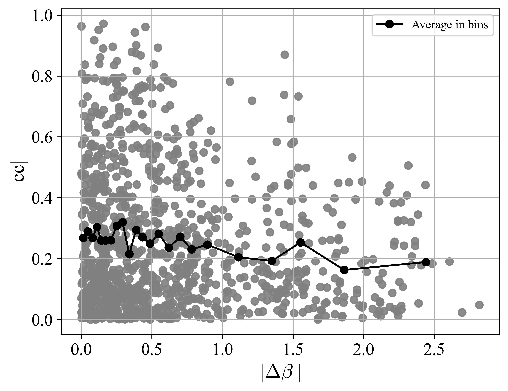

Results from one site

