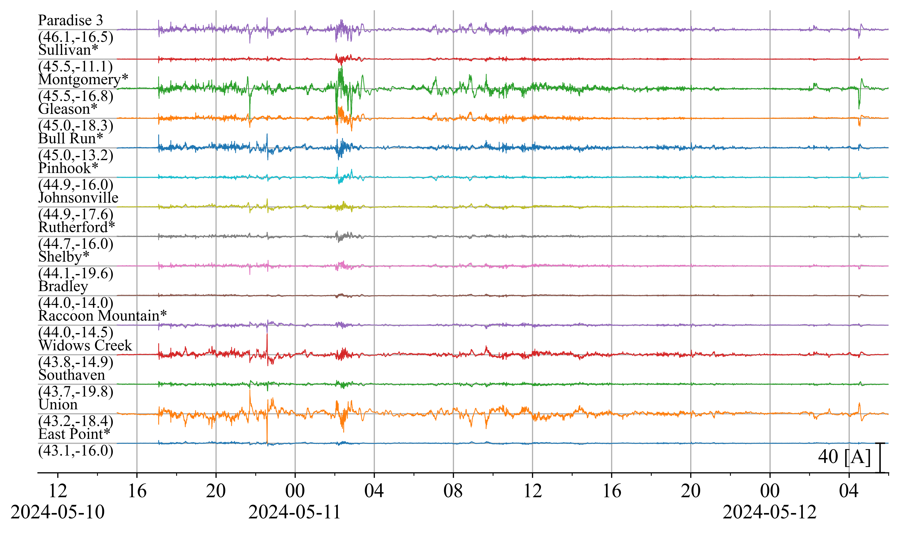
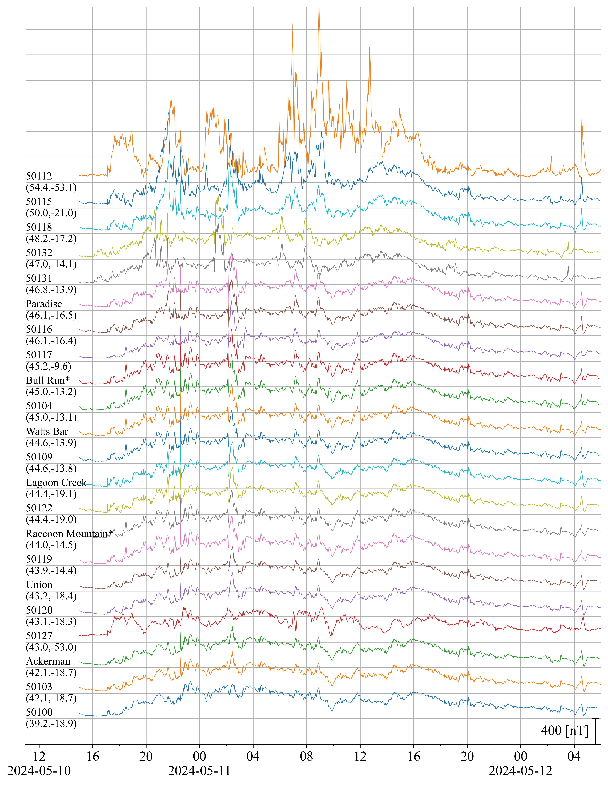
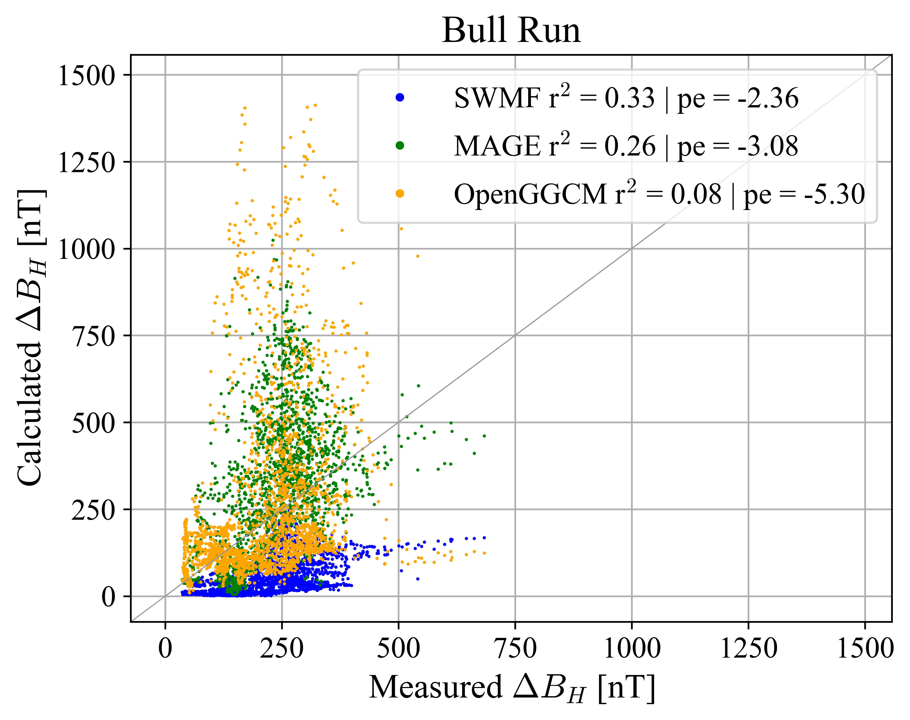
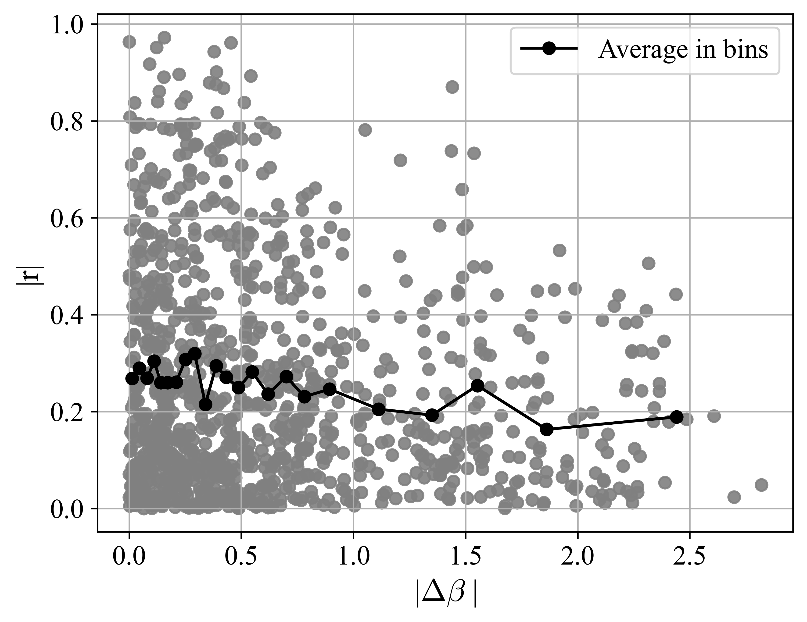
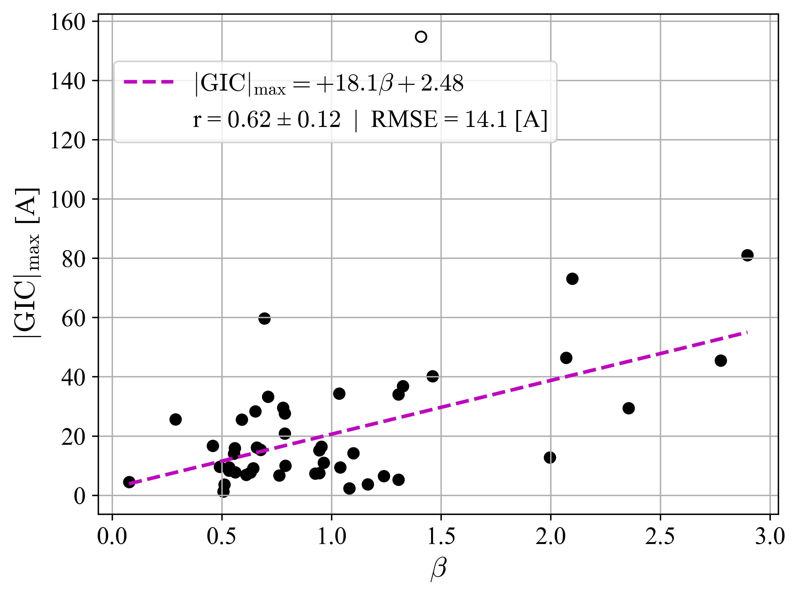

# Overview
This repository is part of the [ChronoStorm project](https://chronostorm.vercel.app), funded by the U.S. National Science Foundation (NSF) under grant [#2434136](https://www.nsf.gov/awardsearch/showAward?AWD_ID=2434136).

The source code and project details are available in the [SWERVE](https://github.com/lucywilkerson/SWERVE) repository.

# Maps w GIC and magnetometer sites

# Transmission line analysis

# Data plots for paper

# TVA GIC vs GIC modeled (TVA and GMU)

for all GIC timeseries comparisons, see 

for just TVA GIC timeseries comparisons, see 

for just GMU GIC timeseries comparisons, see 

# TVA B vs MAGE/SWMF modeled

for all B timeseries comparisons, see 

# GIC Time Series Comparisons for site pairs

similar figures for all site pairs (2024-AGU-data/_results/pairs/site1_site2.png)
or see 

# Cross Correlation of Site Pairs

see  for cross correlation analysis of each pair

# GIC CC-Distance Map Comparisons

similar figures for 55 more sites (2024-AGU-data/_processed/sitename/cc_vs_dist_map.png)

# GIC CC-Distance Scatter Comparisons

similar figures for 55 more sites (2024-AGU-data/_processed/sitename/cc_vs_dist_scatter.png)

# GIC CC-StDev Scatter Comparisons

similar figures for 55 more sites (2024-AGU-data/_processed/sitename/cc_vs_std_scatter.png)

# GIC CC-Beta Scatter Comparisons

 

similar figures for 55 more sites (2024-AGU-data/_processed/sitename/cc_vs_beta_scatter.png)

# GIC CC-Line Voltage Scatter Comparisons

# GIC CC-Latitude Comparisons

# GIC CC-Dist Scatter Comparison w colors

# GIC StDev Scatter Plots

# Regression Analysis
see [linear_regression.md](linear_regression.md) for more detailed analysis
## Correlation coefficient between GIC site pairs
_cc.png)

## Standard deviation of GIC at each site

Table with results: 

## Peak GIC at each site

Table with results: 
