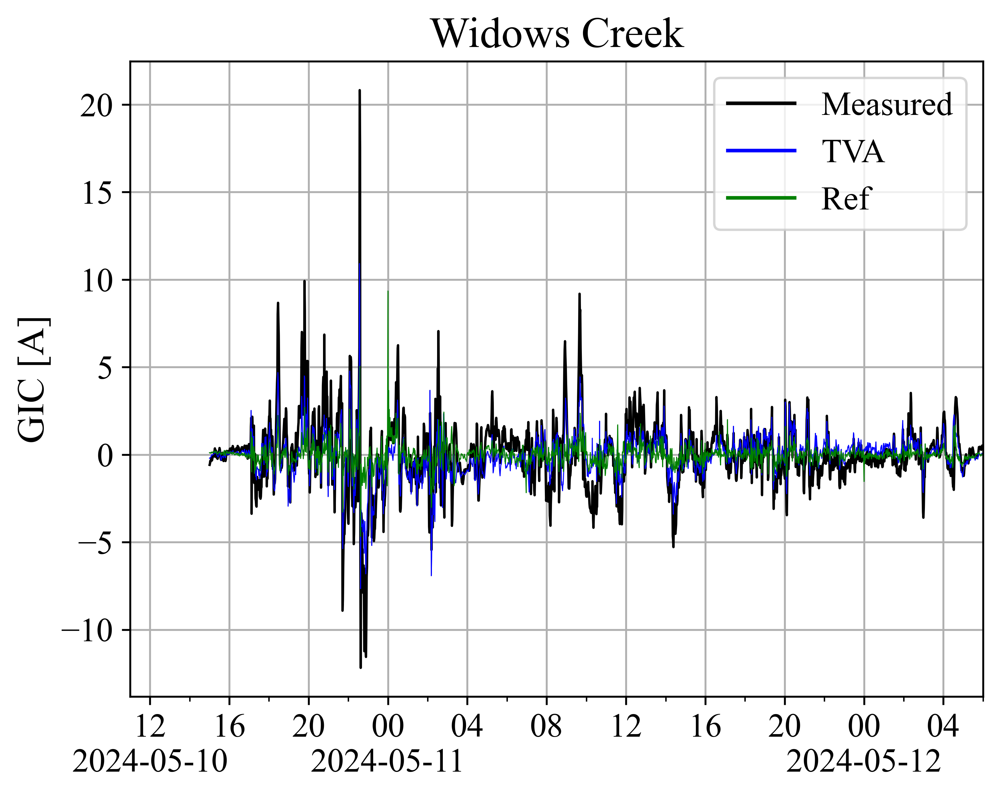
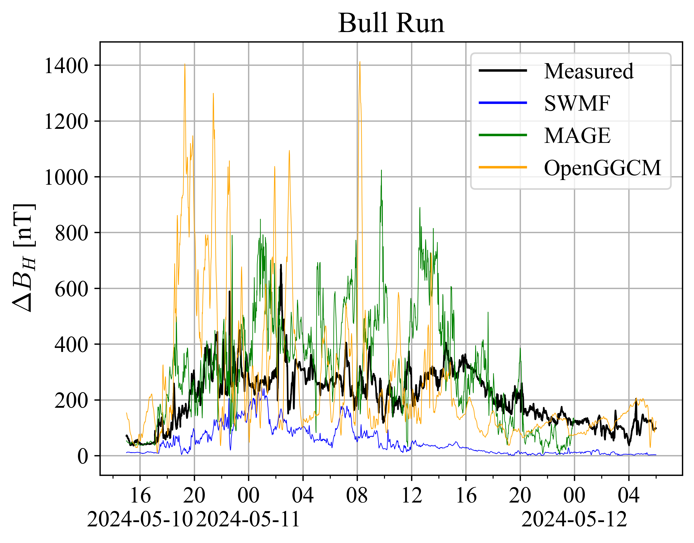
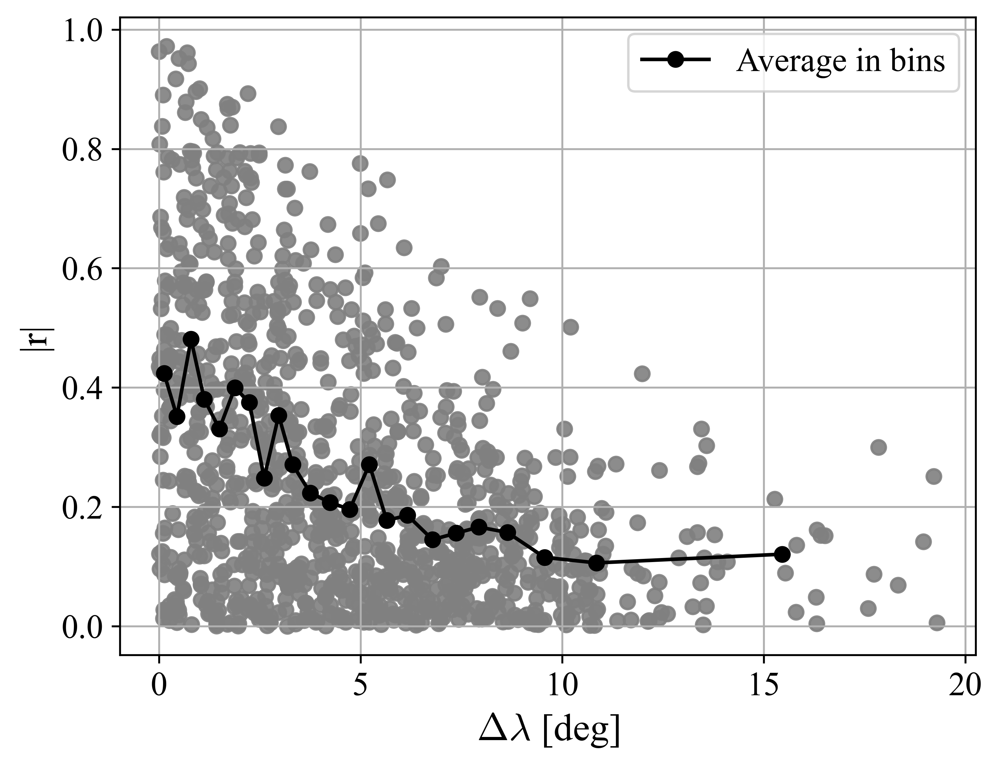

**Space Weather Event Response Validation & Evaluation Hub (SWERVE Hub)** 

## Overview
This repository is part of the [ChronoStorm project](https://chronostorm.vercel.app), funded by the U.S. National Science Foundation (NSF) under grant [#2434136](https://www.nsf.gov/awardsearch/showAward?AWD_ID=2434136). The project aims to collect and analyze perishable operational data from critical infrastructure sectors during significant space weather events, particularly during the solar maximum of Solar Cycle 25.

SWERVE Hub provides a centralized environment for validating and comparing space weather metrics for the May 2024 ("Gannon Storm"), including magnetic field variations, geoelectric field responses, and geomagnetically induced currents (GICs). This hub offers validated, cross-referenced data and tools for researchers and infrastructure stakeholders interested in space weather assessment.

## Project Background
In May 2024, Earth experienced a series of extreme space weather events, collectively referred to as the "Gannon Storm." These events included multiple Earth-directed coronal mass ejections (CMEs), triggering intense geomagnetic storms between May 10–12, 2024. 

The storm provided a rare opportunity to observe rapid fluctuations in Earth's magnetic field and to measure the resulting geoelectric fields and GICs, which pose risks to critical infrastructure, especially electrical power systems. The SWERVE Hub supports research into how different measurement and modeling approaches quantitatively compare in capturing these phenomena.

## Repository Contents
- **Data Files**: Magnetic field data, geoelectric field estimates, and GIC measurements from various sources during the May 2024 storm.
- **Analysis Scripts**: Code for preprocessing, analyzing, and visualizing the storm response across physical domains.
- **Documentation**: Descriptions of data sources, validation methodology, and results from comparative analyses.

## Goals
- Validate and compare a range of datasets and model outputs for storm-time metrics.
- Provide accessible, structured data for the research community.
- Support space weather infrastructure resilience efforts through better understanding of space weather impacts.

## Funding Acknowledgment
This work was supported by the U.S. National Science Foundation (NSF) under grant [#2434136](https://www.nsf.gov/awardsearch/showAward?AWD_ID=2434136) as part of the ChronoStorm project. The research focuses on collecting and analyzing perishable operational data from critical infrastructure sectors during significant space weather events, aiming to enhance our understanding of infrastructure vulnerabilities and resilience. 

This grant is co-funded by the NSF GEO/AGS Space Weather Research program and the ENG/CMMI Humans, Disasters, and the Built Environment (HDBE) program.

## Data Acknowledgment
We kindly thank the Tennessee Valley Authority (TVA) for providing data from their internal GIC estimation model, reflecting the realistic circuit configuration over the May 10-12th 2024 period. Without TVA's support, and this perishable data, we would struggle to compare predictive metrics to this more reliable baseline. 

## Contributors 
- Lucy Wilkerson - Graduate Research Assistant (lwilker [ at ] gmu [ dot ] edu) 
- Bob Weigel - Senior Personnel (rweigel [ at ] gmu [ dot ] edu)
- Dean Thomas - Research Fellow (dthomas6 [ at ] gmu [ dot ] edu) 
- Edward Oughton - Primary Investigator (eoughton [ at ] gmu [ dot ] edu)

## License
This repository is licensed under the MIT License. See `LICENSE` for details.

# Maps w GIC and magnetometer sites

# Transmission line analysis

# Data plots for paper

# TVA GIC vs GIC modeled (TVA and GMU)

for all GIC timeseries comparisons, see 

for just TVA GIC timeseries comparisons, see 

for just GMU GIC timeseries comparisons, see 

# TVA B vs MAGE/SWMF modeled

for all B timeseries comparisons, see 

# GIC Time Series Comparisons for site pairs

similar figures for all site pairs (2024-AGU-data/_results/pairs/site1_site2.png)
or see 

# Cross Correlation of Site Pairs

see  for cross correlation analysis of each pair

# GIC CC-Distance Map Comparisons

similar figures for 55 more sites (2024-AGU-data/_processed/sitename/cc_vs_dist_map.png)

# GIC CC-Distance Scatter Comparisons

similar figures for 55 more sites (2024-AGU-data/_processed/sitename/cc_vs_dist_scatter.png)

# GIC CC-StDev Scatter Comparisons

similar figures for 55 more sites (2024-AGU-data/_processed/sitename/cc_vs_std_scatter.png)

# GIC CC-Beta Scatter Comparisons

similar figures for 55 more sites (2024-AGU-data/_processed/sitename/cc_vs_beta_scatter.png)

# GIC CC-Line Voltage Scatter Comparisons

# GIC CC-Latitude Comparisons

# GIC CC-Dist Scatter Comparison w colors

# GIC StDev Scatter Plots

# Regression Analysis
## Correlation coefficient between GIC site pairs
_cc.png)

## Standard deviation of GIC at each site

## Peak GIC at each site

