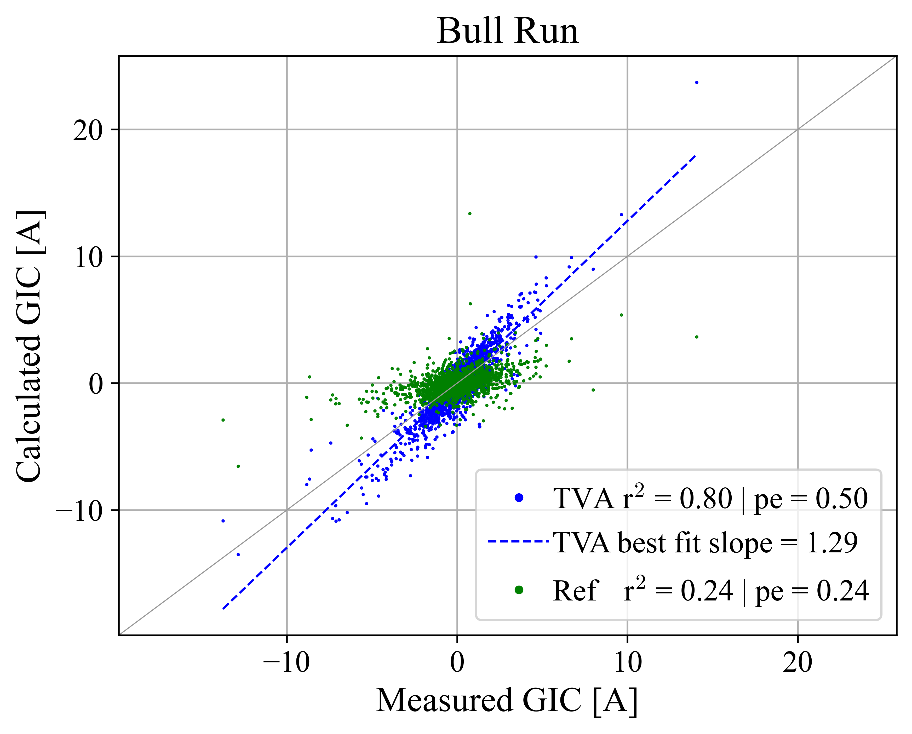
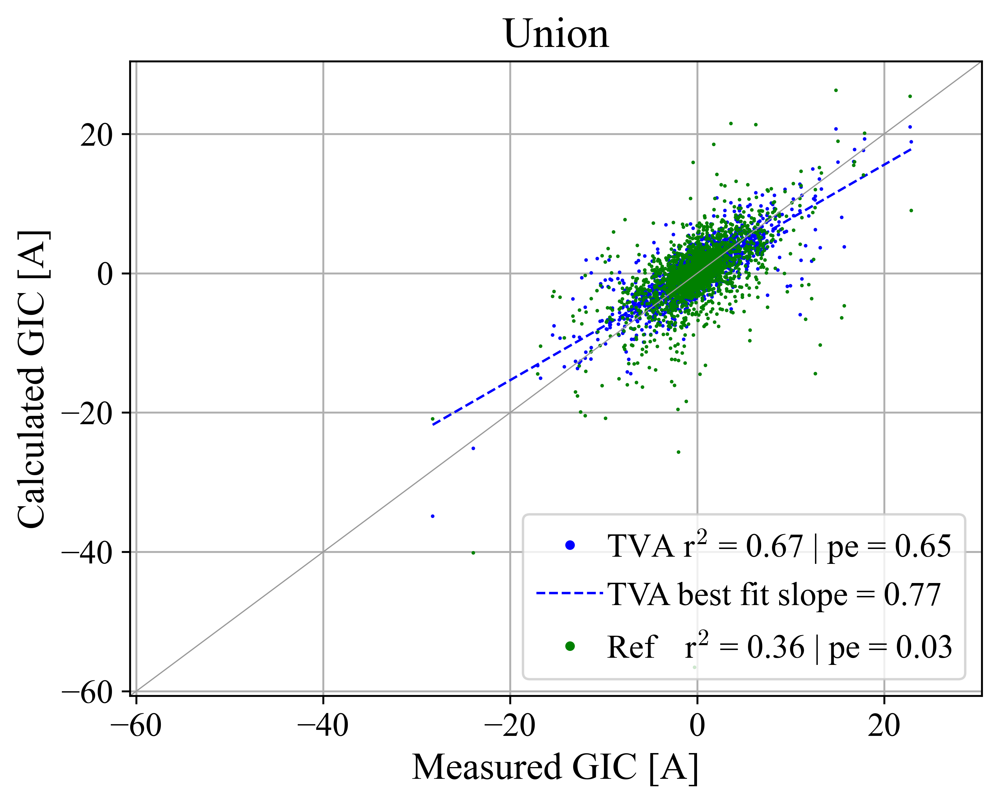
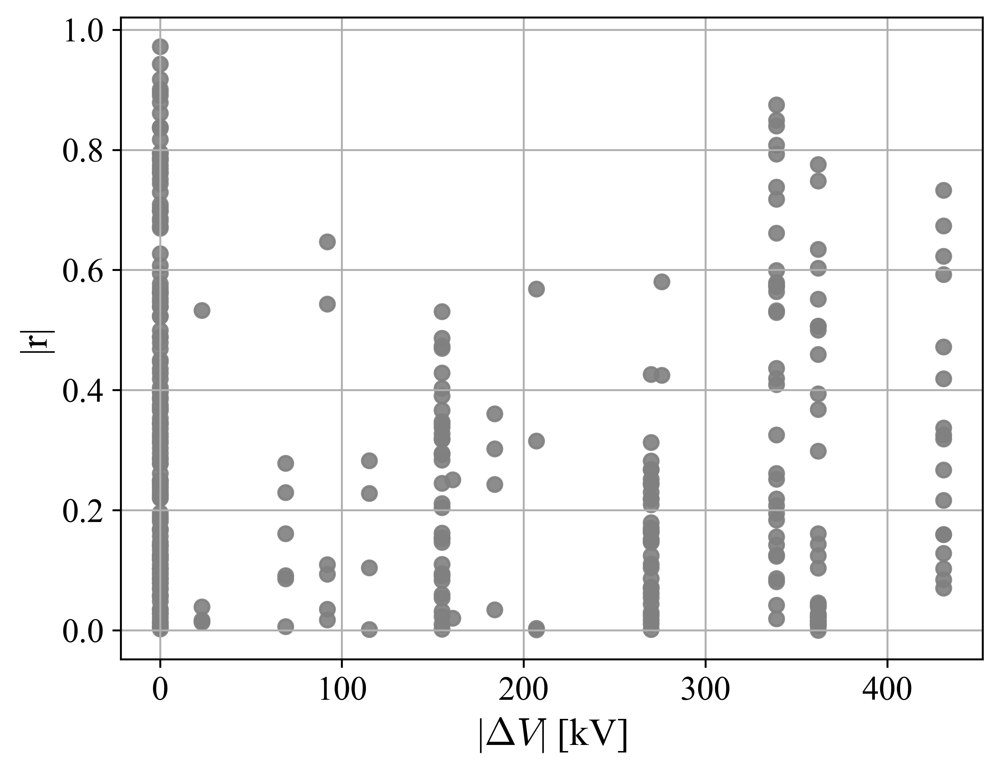

# Summary

# Maps w GIC and magetometer sites

# Transmission line analysis

# TVA GIC vs TVA GIC modeled

# TVA B vs MAGE/SWMF modeled

# GIC Time Series Comparisons for site pairs

similar figures for all site pairs (2024-AGU-data/_results/pairs/site1_site2.png)

# GIC CC-Distance Map Comparisons

similar figures for 55 more sites (2024-AGU-data/_processed/sitename/cc_vs_dist_map.png)

# GIC CC-Distance Scatter Comparisons

similar figures for 55 more sites (2024-AGU-data/_processed/sitename/cc_vs_dist_scatter.png)

# GIC CC-StDev Scatter Comparisons

similar figures for 55 more sites (2024-AGU-data/_processed/sitename/cc_vs_std_scatter.png)

# GIC CC-Beta Scatter Comparisons

similar figures for 55 more sites (2024-AGU-data/_processed/sitename/cc_vs_beta_scatter.png)

# GIC CC-Line Voltage Scatter Comparisons

# GIC CC-Dist Scatter Comparison w colors

