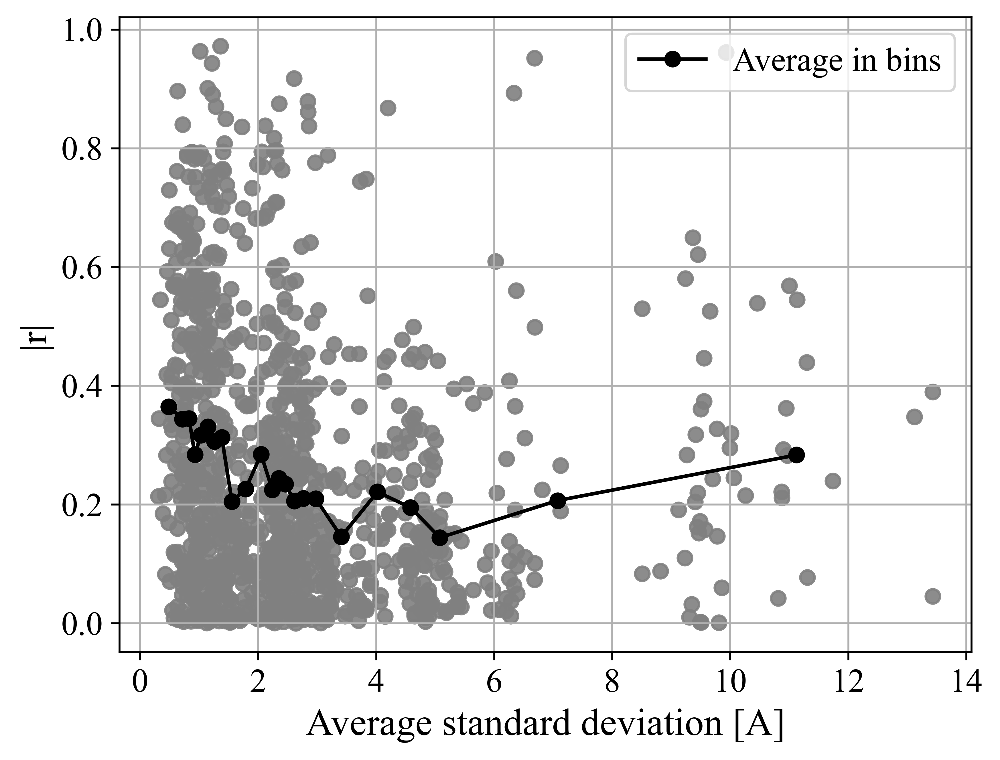

# Summary

# Maps w GIC and magetometer sites

# Transmission line analysis

# TVA GIC vs TVA GIC modeled

# TVA B vs MAGE/SWMF modeled

# GIC Time Series Comparisons

# GIC Time Series CC Comparisons
Overview
Results from one site

# GIC Time Series dist Comparisons

Results from one site

# GIC Time Series std Comparisons

Results from one site

# GIC Time Series Beta Comparisons

Results from one site

