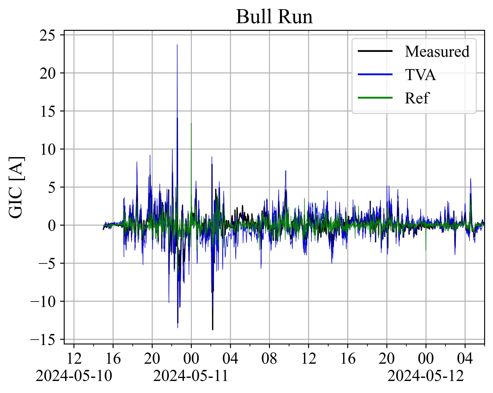
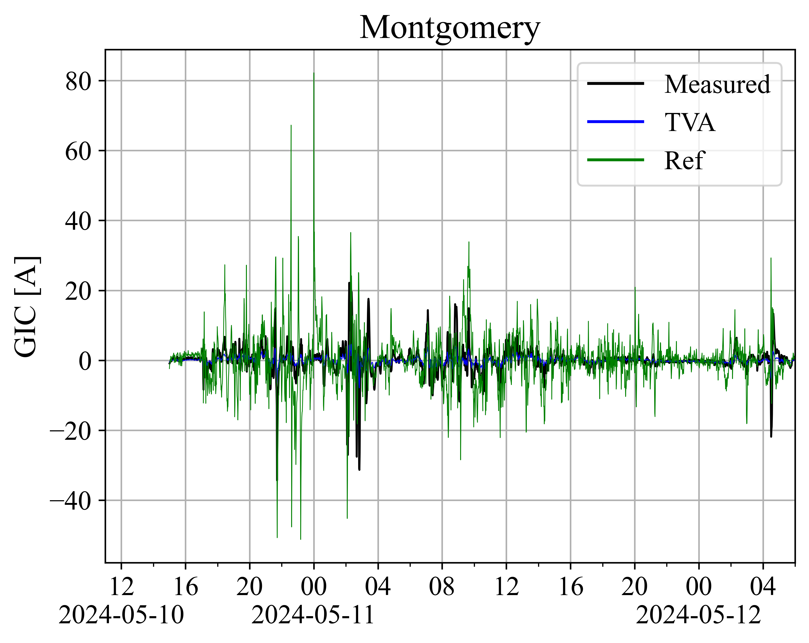
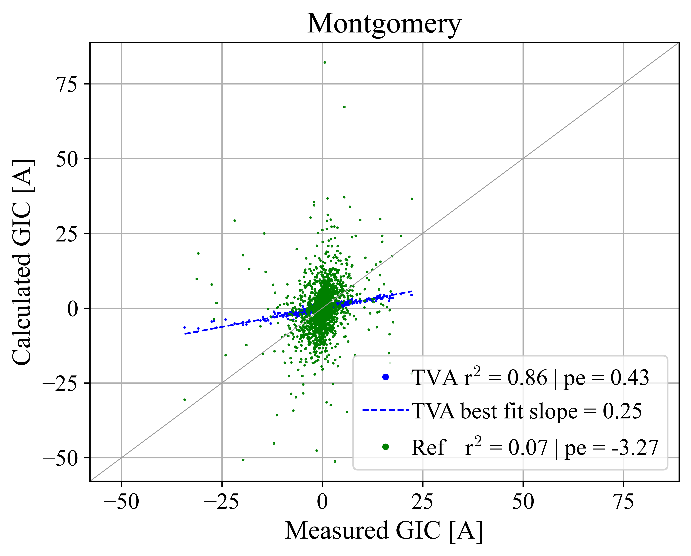
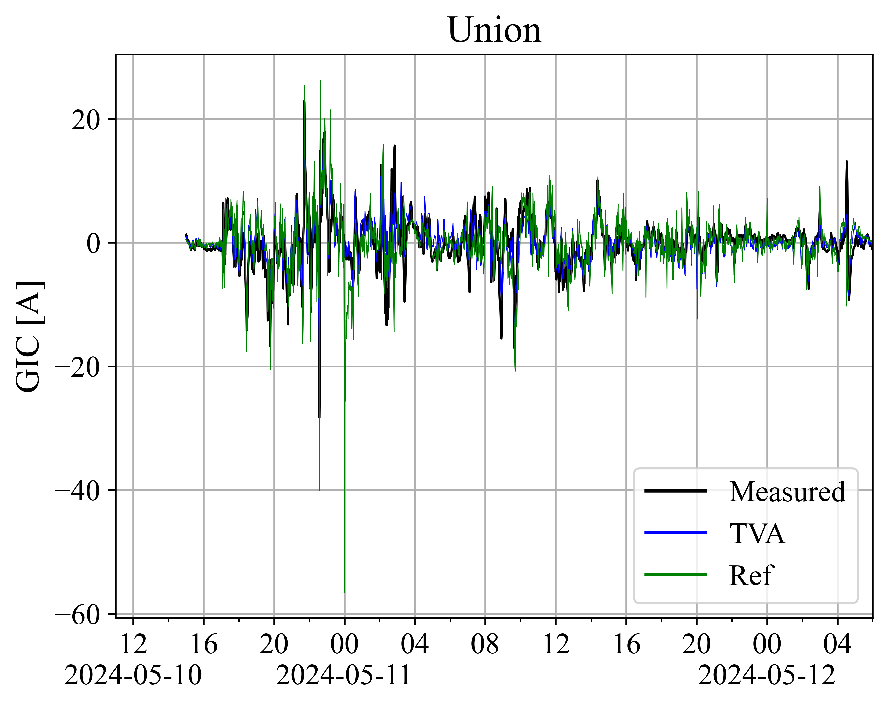
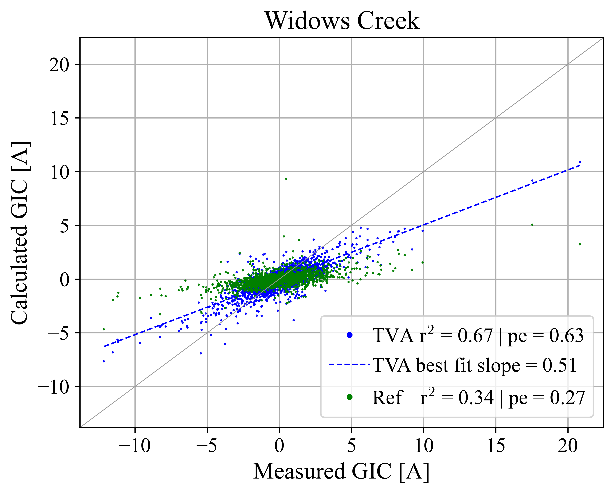
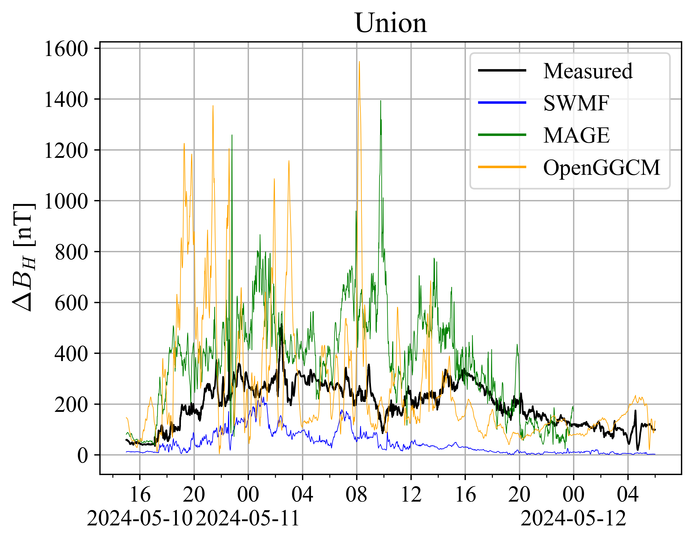

# Summary

# Maps w GIC and magetometer sites

# Transmission line analysis

# TVA GIC vs TVA GIC modeled

# TVA B vs MAGE/SWMF modeled

# GIC Time Series Comparisons for TVA sites

# GIC Time Series CC Comparisons

similar figures for 55 more sites (2024-AGU-data/_processed/sitename/cc_vs_dist_map.png)

# GIC Time Series dist Comparisons

similar figures for 55 more sites (2024-AGU-data/_processed/sitename/cc_vs_dist_scatter.png)

# GIC Time Series std Comparisons

similar figures for 55 more sites (2024-AGU-data/_processed/sitename/cc_vs_std_scatter.png)

# GIC Time Series Beta Comparisons

similar figures for 55 more sites (2024-AGU-data/_processed/sitename/cc_vs_beta_scatter.png)

