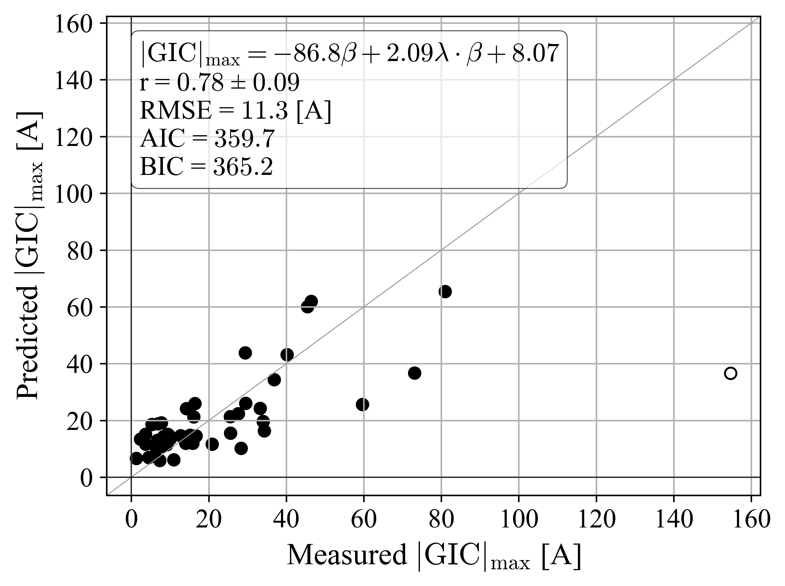

# $\sigma$ regression analysis

## $\sigma$ vs $\beta$

## $\sigma$ vs $\log_{10}\beta$

## $\sigma$ vs $\lambda$

## $\sigma$ vs $\beta$ and $\lambda$

## $\sigma$ vs $\beta$ and $\lambda$ with cross term

### Table with results: 

# $|\text{GIC}_\text{max}|$ regression analysis

## $|\text{GIC}_\text{max}|$ vs $\beta$

## $|\text{GIC}_\text{max}|$ vs $\log_{10}\beta$

## $|\text{GIC}_\text{max}|$ vs $\lambda$

## $|\text{GIC}_\text{max}|$ vs $\beta$ and $\lambda$

## $|\text{GIC}_\text{max}|$ vs $\beta$ and $\lambda$ with cross term

### Table with results: 
